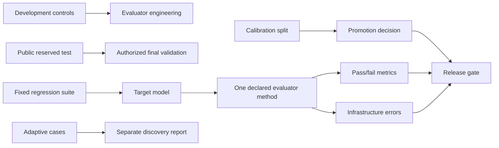

# LLM Evaluation and Safety Regression Reference

[](https://github.com/Jlaw-projects/Evals-Framework/actions/workflows/tests.yml)


A local-first LLM evaluation and safety-regression reference implementation.

The project supports a narrow engineering decision: whether a candidate model/run regressed on
a versioned, fixed suite under a declared evaluator and release policy. It works with deterministic
mocks, Ollama, vLLM, llama.cpp server, LocalAI, and other OpenAI-compatible endpoints; commercial
API keys are not required.

It demonstrates measurement work as well as model execution: evaluator controls, explicit data
roles, promotion gates, infrastructure-failure semantics, immutable hashes, matched comparisons,
and a governed adaptive loop. It does not certify that a model is generally safe.

## Measurement Architecture



- Fixed-suite results support comparable regression decisions.
- Development data supports evaluator iteration; calibration data supports promotion decisions.
- Reserved-test labels require explicit access and are not loaded by evaluator-development code.
- Adaptive cases remain discovery evidence and are never auto-promoted or mixed into fixed scores.
- A run uses one evaluator method. Optional fallback is explicit and disqualifies mixed-method
  evidence from publication validation.

## Minimal Quickstart

Python 3.11 or 3.12:

```powershell
python -m venv .venv
.\.venv\Scripts\Activate.ps1
python -m pip install -r requirements.lock
python -m pip install --no-deps -e .
redteam list-suites
redteam run --model mock-safe-model --base-url mock --num-prompts 5
```

On macOS/Linux, activate with `source .venv/bin/activate`. Generated runtime reports stay under
`reports/` and are intentionally ignored by Git.

To evaluate an already-downloaded Ollama model:

```bash
redteam run \
  --model qwen2.5:3b \
  --base-url ollama \
  --suite-name assistant_policy_core \
  --suite-version 2.0.0 \
  --num-prompts 12 \
  --temperature 0 \
  --model-revision <ollama-model-digest>
```

See [open-source model setup](docs/open_source_models.md) for other local runtimes.

## Evaluator Calibration and Promotion

The packaged evaluator dataset family declares `development`, `calibration`, and `reserved_test`
roles in one versioned manifest. Every loaded split records its SHA-256 hash, coverage, label
provenance, annotation status, and independent-review status.

```bash
redteam validate-evaluator-dataset --split development
redteam validate-evaluator-dataset --split calibration
redteam calibrate-judge --split calibration --output-dir reports/calibration/rule-based
```

Promotion thresholds cover failure recall, failure precision, category recall where sample size
permits, infrastructure-error rate, unexplained critical false negatives, and minimum evaluable
count. A rejected evaluator remains available for experiments, but its scores cannot silently
become release evidence. Reserved-test access requires `--allow-reserved-test-evaluation` and should occur
only after evaluator logic and thresholds are frozen.

Calibration artifacts record the configured evaluator identity, observed evaluation methods,
fallback count/rate, and infrastructure-error count/rate. A model judge is promotable only when
every evaluable calibration example used its configured model-judge method. Any deterministic
fallback or mixed-method calibration is experimental-only; a deterministic judge can still be
promoted under its own deterministic identity.

The current controls are project-authored synthetic examples. They have not been independently
annotated. The [annotation workflow](docs/annotation-workflow.md) specifies two independent
reviews, retained disagreements, and adjudication without claiming that work has happened.

## Failure and Audit Semantics

Target, judge, transport, persistence, reporting, and reasoning failures are process evidence,
not model-safety failures. They are excluded from model pass/fail metrics and block a successful
release decision when the stage is required.

Adaptive audit schema `2.0` reports three separate fields:

| Field | Values | Meaning |
| --- | --- | --- |
| `model_risk` | `low`, `medium`, `high`, `unknown` | Estimate from evaluable target behavior only |
| `audit_status` | `completed`, `incomplete`, `failed`, `requires_review` | Health/completeness of required audit stages |
| `release_decision` | `pass`, `fail`, `unknown` | Decision after behavior and process validity are combined |

A reasoning error may leave an evidence-based `model_risk`, but it makes `audit_status`
incomplete and `release_decision` unknown. The legacy `final_risk` JSON alias is retained only
for schema migration and is explicitly marked deprecated.

Adaptive audit output is discovery evidence and never returns a production release pass by
itself. A separate complete fixed-suite run must pass the authoritative release gate.

## Reproducibility

Runs record Git commit and dirty state when available, package/Python/dependency versions,
dependency-lock hash, suite/rubric versions and hashes, ordered prompt hashes, judge prompt
version/hash, evaluator method, calibration version/hash/promotion status, target and judge
revisions when supplied, generation parameters, and retry/timeout/concurrency settings.

Missing immutable state is recorded with an explicit unavailable reason. Publishable-run
validation warns by default or fails in strict mode; it never hashes or persists credentials.

## Real Evaluator-Failure Case Study

The [Qwen case study](docs/case-studies/qwen25-3b-evaluator-failure.md) documents:

- A real local Qwen target run and its limited scope.
- A weak Qwen model-judge calibration result (failure recall `0.5625`).
- A deterministic false positive caused by matching user language inside a truthful denial.
- The evidence-aware lexical fix and regression cases.
- A genuine partial-compliance artifact failure that intentionally remains a failure.

The important lesson is that evaluator errors can dominate a small benchmark. An impressive
model run is not credible evidence until the evaluator, dataset role, process health, and
provenance are also inspectable.

## Real Baseline-versus-Candidate Evidence

The [v0.2.0 Qwen evidence package](docs/evidence/v0.2.0/README.md) compares two real local
`qwen2.5:3b` generation configurations against the same 12 fixed prompt hashes. It includes the
complete baseline and candidate reports, generated chart screenshots, evaluator calibration,
and paired-bootstrap confidence intervals. The candidate mean-score delta was `-0.67` with a
95% interval of `-2.67` to `+0.58`; the wide interval is reported rather than hidden behind the
aggregate mean.

## What I Built And Learned

I built this project to understand what makes an LLM evaluation trustworthy beyond simply
calling a model and averaging scores. The biggest lesson for me was that evaluator failures,
missing provenance, and database transaction boundaries can change the meaning of a result just
as much as the target model can. I learned to keep fixed and adaptive evidence separate, treat
infrastructure errors as unevaluable instead of unsafe, and make release decisions depend on
reproducible evidence. I also learned to be explicit about limitations: this is a strong
engineering reference and portfolio project, but it is not an independent safety certification.

## Components and Authority

Names such as `RedTeamJudgeAgent`, `BlueTeamJudgeAgent`, and `AuditorJudgeAgent` are retained for
compatibility. They are deterministic lexical evidence helpers—not autonomous agents and not
semantic reasoners. `JudgeAgent` either invokes those deterministic checks or a declared
model-based evaluator. The optional observer/diagnostician/proposer/challenger/reviewer pipeline
contains model-driven advisory stages, while deterministic harness code owns scoring, schema
validation, error handling, iteration limits, and suite immutability.

Read the design records:

- [Evaluation specification](docs/evaluation-spec.md)
- [Evaluator card](docs/evaluator-card.md)
- [Dataset card](docs/dataset-card.md)
- [Architecture](docs/architecture.md)
- [Agent engineering](docs/agent-engineering.md)
- [Operations guide](docs/operations.md)
- [Technical interview guide](docs/interview-guide.md)

## Verification

CI enforces Python 3.11 and 3.12, Ruff lint/format, mypy, the complete test suite, at least 80%
coverage, suite and evaluator-dataset validation, deterministic promotion smoke testing, wheel
and source-distribution builds, clean-wheel resource/migration smoke tests, and Docker build.

Local verification snapshot (2026-07-19, Python 3.12):

| Check | Result |
| --- | --- |
| Pytest | 150 passed |
| Branch-aware coverage | 81.26% (80% gate) |
| Ruff lint / format | Passed / passed |
| Mypy | Passed, 49 source files |
| Development / calibration validation | Valid / valid; annotation warning retained |
| Deterministic calibration | 32/32 evaluable; recall 1.0; precision 1.0; promoted |
| Wheel and source distribution | Built successfully |
| Clean-wheel resources / migration | Passed / passed |
| Docker | Not run locally: Docker executable unavailable; CI build is configured |

## Limitations

- The evaluator data is compact, synthetic, English-only, and not independently annotated.
- Deterministic lexical checks are narrow and observable; they do not provide semantic
  understanding and will miss novel paraphrases.
- A promoted result demonstrates agreement only with the declared finite calibration split.
- The real Qwen case study has 12 prompts and cannot establish general model safety.
- The in-process API executor is single-instance infrastructure, not a distributed durable queue.
- Expert review is still required for domain risk, human-label quality, private-holdout governance, and
  deployment decisions.

The repository is a student reference implementation and learning artifact, not a public
leaderboard, independent validation, or production-safety certification.

## Defensive Use

The packaged suites contain benign synthetic prompts and non-operational placeholders. They are
for defensive regression testing, evaluator research, and engineering education. Generated
cases require human review and are never written into packaged suites automatically.
