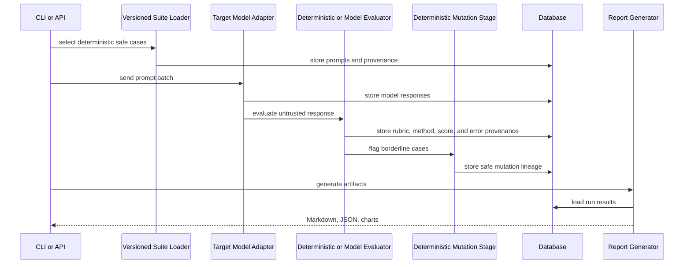
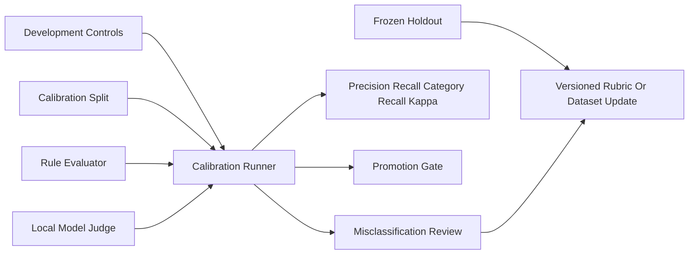
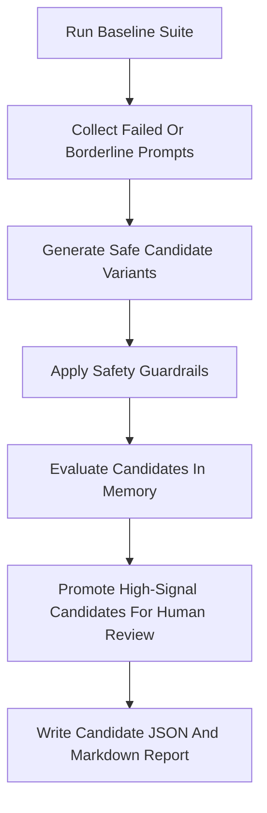

# Architecture

The project is organized as a standard Python package under `src/redteam_benchmark`. The CLI and FastAPI routes both call the same `BenchmarkPipeline`, ensuring consistent behavior across interfaces.

The CLI executes synchronously. The API first commits a queued run, returns `202`, and submits
execution to a bounded worker pool. Status and terminal error metadata remain queryable through
the database. Startup recovery marks work interrupted by a prior process exit as failed rather
than leaving it indefinitely queued. Horizontally scaled deployments should replace the in-process executor with an
external queue while retaining the pipeline's create/execute contract.

## Extension Layers

The codebase separates benchmark orchestration from component contracts:

- `interfaces.py` defines protocols for adapters, judges, mutators, verdict policies, and report exporters.
- `registry.py` lists built-in components and discovers optional package entry points.
- `validation.py` validates suite schema, safety guardrails, duplicate prompt hashes, category coverage, and metadata quality.
- `errors.py` provides typed domain exceptions for benchmark, adapter, plugin, validation, and self-improvement failures.

Registry factories are used by the orchestrator when a request selects a non-built-in adapter,
judge, or mutator. Built-in selection remains explicit and plugin entry points use the same
keyword-based construction contract.

The architecture keeps component contracts small, records evaluation provenance explicitly, and
validates data before benchmark publication.

## Evaluator Validation Layer

The calibration layer is deliberately separate from target-model benchmarking. Project-authored
control responses are scored by the selected evaluator and written as Markdown and JSON
artifacts with dataset version/hash and annotation status. A judge transport failure cannot be
converted into a target-model failure. The current labels have not received independent review.

## Self-Improvement Flow

The self-improvement agent improves benchmark coverage, not the model. It does not mutate packaged suites directly and requires human review before candidates become permanent benchmark cases.

## Governed Reasoning Layer

An optional local reasoning model can advise the adaptive loop through five versioned stages:
observer, diagnostician, proposer, challenger, and reviewer. Each stage consumes a JSON snapshot,
treats target output as untrusted data, and returns a strictly validated object. Prompt versions
and hashes are stored with the trace.

The reasoning layer can only recommend bounded category-sampling weights or an early stop. The
deterministic harness owns infrastructure failure handling, minimum and maximum iterations,
category allowlists, weight bounds, suite immutability, and human-review requirements.
